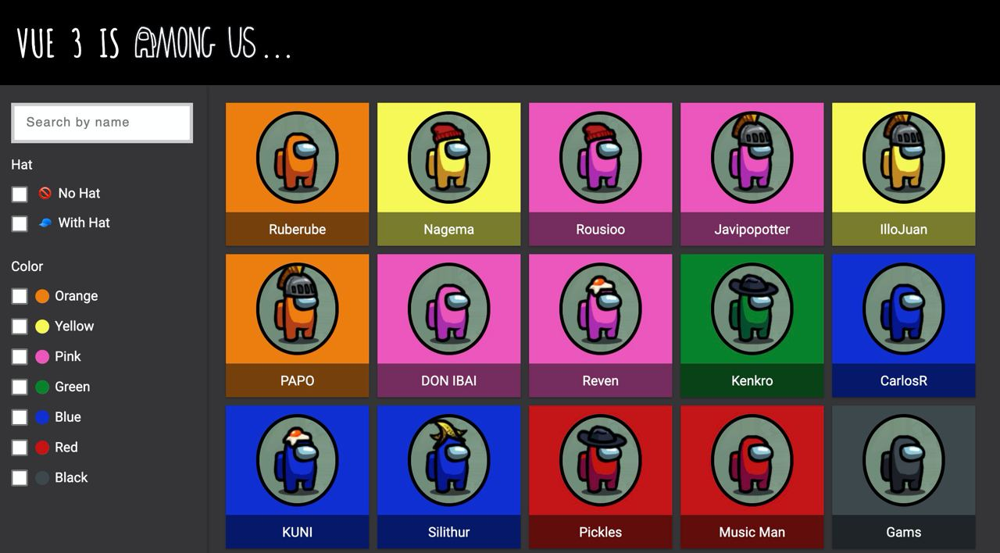

# vue-is-among-us



## Branches
- master 👉 vue2
- vue3 👉 vue3

## Project setup
```
npm install
```

### Compiles and hot-reloads for development
```
npm run serve
```

### Compiles and minifies for production
```
npm run build
```

### Lints and fixes files
```
npm run lint
```

### Customize configuration
See [Configuration Reference](https://cli.vuejs.org/config/).

### package.json migration from v2 to v3
- "vue": "^2.6.11" 👉 "vue": "^3.0.0-0"
- "eslint-plugin-vue": "^6.2.2" 👉  "eslint-plugin-vue": "^7.0.0-0"
- "sass-loader": "^10.0.2" 👉 "sass-loader": "^8.0.2"
- "vue-template-compiler": "^2.6.11" 👉 "@vue/compiler-sfc": "^3.0.0-0"
- "plugin:vue/essential" 👉  "plugin:vue/vue3-essential"
